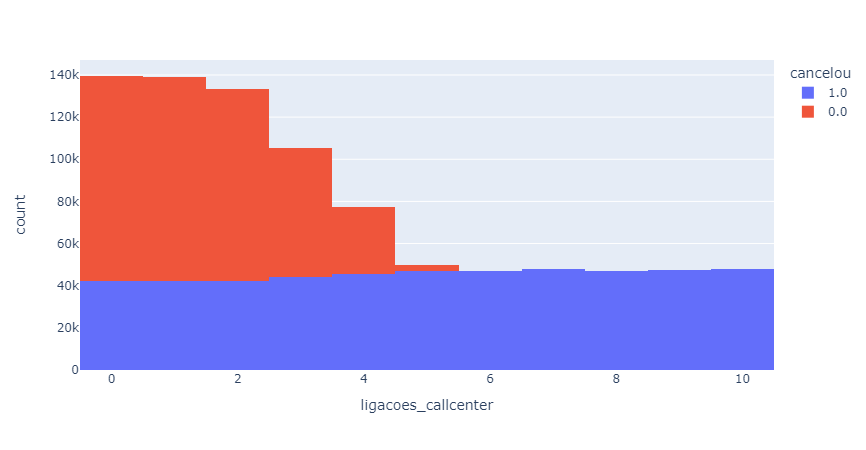
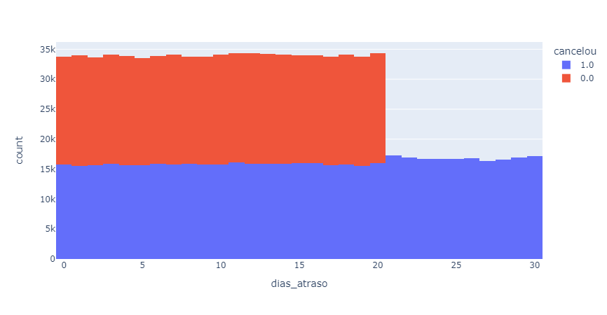

# Data Analysis Project

This project involves data analysis using Python, with pandas and plotly libraries. The main objective is to analyze cancellation data, and propose solutions for the main causes of the cancelation

## Example Visualizations




## Getting Started

These instructions will get you a copy of the project up and running on your local machine for development and testing purposes.

### Prerequisites

What things you need to install the software and how to install them:

- Python 3.x
- Libraries: pandas, numpy, matplotlib, seaborn, plotly

### Installing

A step by step series of examples that tell you how to get a development environment running:

1. Install all the files in this link [https://drive.google.com/drive/folders/1HLQZ6P29h6wDFwzzBM2iWNRfvTnrVO4B?usp=sharing]()
2. Navigate to the project directory
3. Install the required libraries using pip:

```
!pip install pandas plotly
```

```

## Built With

* [Python](https://www.python.org/) - The programming language used
* [Pandas](https://pandas.pydata.org/) - Data manipulation and analysis library
* [Plotly](https://plotly.com/python/) - Interactive data visualization library
```
